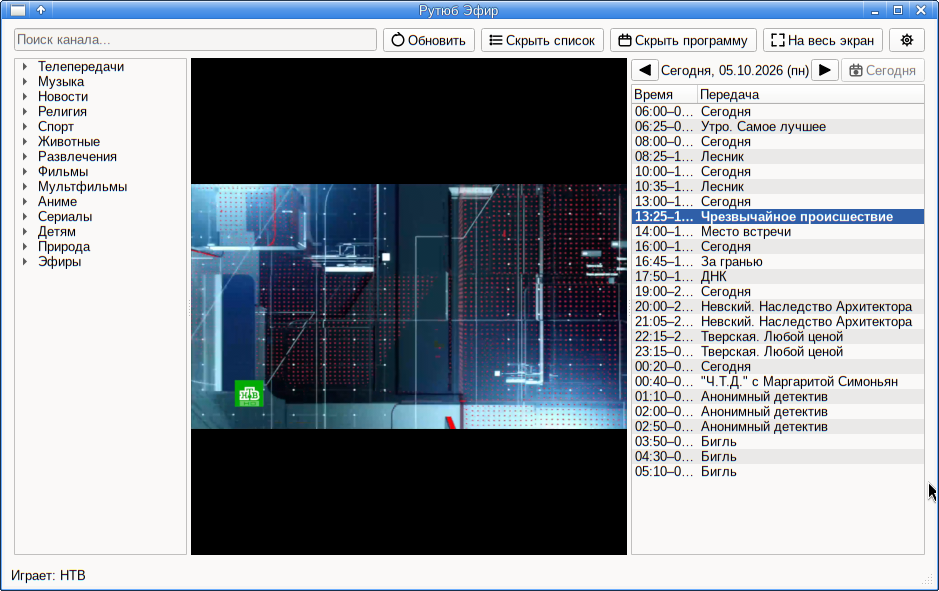

# 📺 Рутюб Эфир

Настольное приложение для просмотра прямых эфиров Rutube: список каналов
с группами и поиском, программа передач и воспроизведение через **mpv**
в одном окне — без браузера.



## ✨ Возможности

* 📡 автозагрузка списка каналов с кешем и офлайн-стартом;
* 🗂️ группы каналов, поиск, переименование и перенос каналов вручную;
* 📅 программа передач с подсветкой текущей передачи;
* 🖼️ логотипы, описания и подкатегории каналов (фоновая предзагрузка);
* 📺 полный экран (`F11`/`F`, `Esc` — выйти), плейлист (`Ctrl+L`),
  программа передач (`Ctrl+P`), настройки (`Ctrl+,`);
* 🌐 прокси: RU API-прокси (в том числе выбор из списка российских
  узлов) и отдельный прокси для потока.

## 🛠️ Стек технологий

| Технология | Назначение |
| :--- | :--- |
| **Python** | Логика приложения |
| **PyQt6** | Графический интерфейс (UI/UX) |
| **mpv / python-mpv** | Воспроизведение потоков (встроен в окно через `wid`) |
| **requests** | Загрузка данных и работа с прокси |

> 🐧 **Примечание к выбору стека:** Данный набор технологий выбран неслучайно. Автор является убежденным пользователем **Linux**, а Windows за полноценную операционную систему не считает. Проект изначально затачивался под Unix-подобные системы, но благодаря кроссплатформенности стека запустится и на «остальных» ОС.

## 🚀 Запуск

```bash
pip install PyQt6 requests python-mpv   # + mpv/libmpv в системе
python3 rutube-efir.py
```

## 🔨 Инструменты разработки

Проект создан с помощью **вайб-кодинга** (Vibe Coding) в синергии с большой языковой моделью **MiMo-V2.6-Flash Free**, которая помогла спроектировать архитектуру и написать интерфейс плеера.

## 💸 Поблагодарить

* **USDT (TRC-20):** `TBGQZUwquq2yLPZzwYUpgYYPeLMcbJSLoz`
* **BTC (Bitcoin Mainnet):** `1KbXEYvGY4oURR7HCBvCMfhbyEcU3jM8mL`
* 🌐 [WebMoney / ETH / LTC /...](https://pay.web.money/d/fwxz)
* 💳 [MIR Cards / ЮMoney](https://yoomoney.ru/to/410014392099996)
